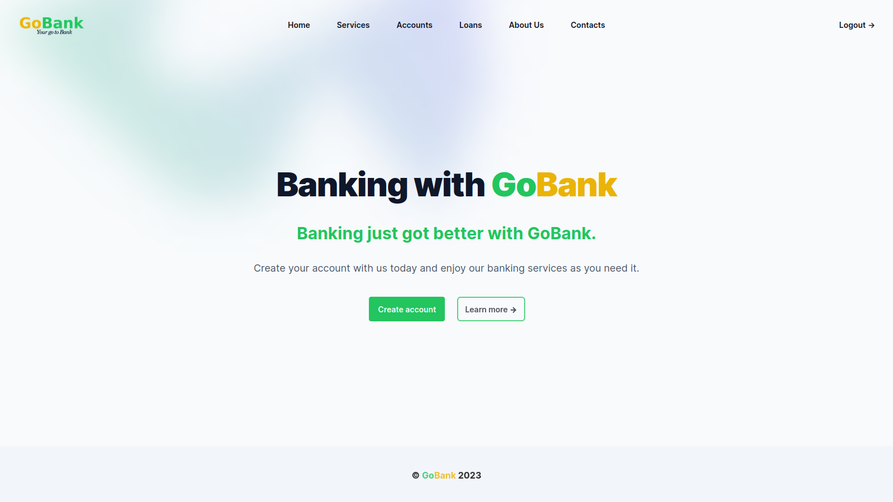

# Gobank

<!--  -->

Gobank is a personal project which is meant to iprove my technical skills in Go programming.
This is a project will enable me to test my creativity and challange myself on large project. In this project i try as much as possible to avoid third party packages like ORM's  for database connnection, instead i use bare SQL commands(so i am also sharpenning my SQL skills).

## Image

## Introduction

This is just a personal implementation of a a banking system and trying to implement security just like the real world banking system.
I am planning to implement the following features:

- Account creation
- Account Verification(Manual of course)
- Account password reset
- Email verification to activate account
- Demo account which has Ksh 50,000(Dummy) to use to simulate a real world transactions.
- Transfer,Deposit and Withdraal capabilities(Demo account)

## Why Go language?

***Why go and not any other programming language?***

I am choosing Go because it is a compilled lanuage which makes it achieve better performance almost as fast as C++.
It provides an easier way to perform concurency which makes it fast.
It is also a Language i have come to love alot because of its simplicity and yet powerful features.

## Implementation

The way i am Implementing this banking system is my own idea without any references other than the respective documentation of tools used.

I am using the folowing packages and tools to implement:

- [gRPC](https://grpc.io/docs/languages/go/) - I ama implementing this software using Microservices and the best way(my opinion) is using gRPC.
- [Fiber](https://docs.fiber.io) - I am using this framework to create the fullstack application(later to be implemented using React).In the maen time i am using html templates for the User Interface.
- [Mailgun](https://www.mailgun.com) - I am using mailgun to send email to the users.
- [Redis](https://redis.io/docs) - I use Redis for caching and as a temporary database(not the main database)
- Mysql/Postgres - Databases for persistence.
- [RabbitMQ](https://www.rabbitmq.com/documentation.html) - Message broker to ensure that requested transaction are processed incase syatem temporary failure(part).
- [Docker & Docker Compose](https://docs.docker.com/)- I will be building a docker Image for these microservices
